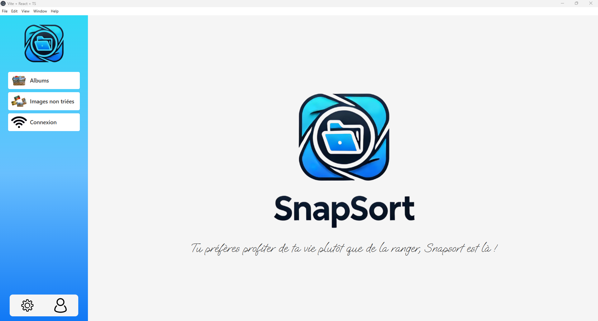
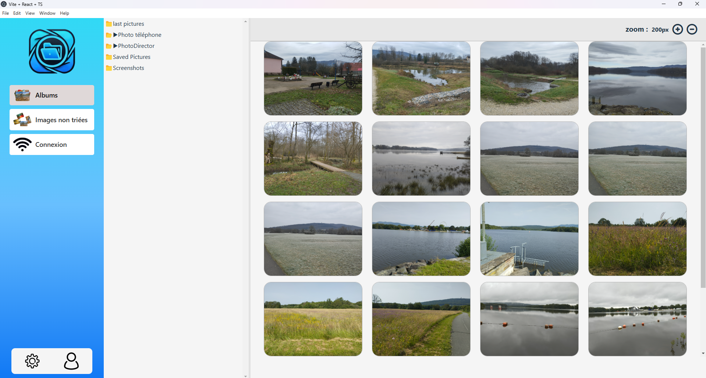

# UQAC-SnapSort-Atelier1

## Présentation v0.5

Snapsort est un projet permettant d'envoyer automatiquement tes photos de vacances sur ton PC. Ensuite, ces photos sont triées comme tu le ferais grâce à un algorithme de tri utilisant l'intelligence artificielle. 

#### Interface principale


#### Interface des photos


## Developpement informatique

### Application Desktop

L'application desktop est développée en ReactJS + Electron + ViteJS.

#### Installation

 - **1.** Récupérer le code source du projet sur votre machine locale.
    ```bash
    git clone https://github.com/ChakSem/UQAC-SnapSort-Atelier1.git
    ```

 - **2.** Vérifier l'installation de :
    - NodeJS (version 18 ou supérieure)
    - NPM (version 8 ou supérieure)

    Pour cela, vous pouvez utiliser les commandes suivantes dans votre terminal :
    ```bash
    node -v
    npm -v
    ```

 - **3.** Se positionner dans le dossier **snapsort** du projet cloné. Ps : c'est le dossier qui contient le fichier **package.json**.
    ```bash
    cd snapsort
    ```
 - **4.** Installer les dépendances du projet.
    ```bash
    npm install
    ```
 - **5.** La phase d'installation est terminée. 

#### Lancer le mode développement
Pour lancer le mode développement, il suffit d'exécuter la commande suivante dans le terminal :
```bash
npm run dev
```

#### Lancer le mode production (Windows seulement)
Pour lancer le mode production, il suffit d'exécuter la commande suivante dans le terminal :
```bash
npm run dist:win
```
**Remarque** : Il est possible que vous ayez besoin de lancer la commande depuis un terminal administrateur pour que l'application puisse s'installer correctement.

Cette commande va créer un dossier **dist** dans le dossier **snapsort** contenant l'application prête à être distribuée. Il suffit de lancer le fichier **Snapsort.exe** pour exécuter l'application.
    